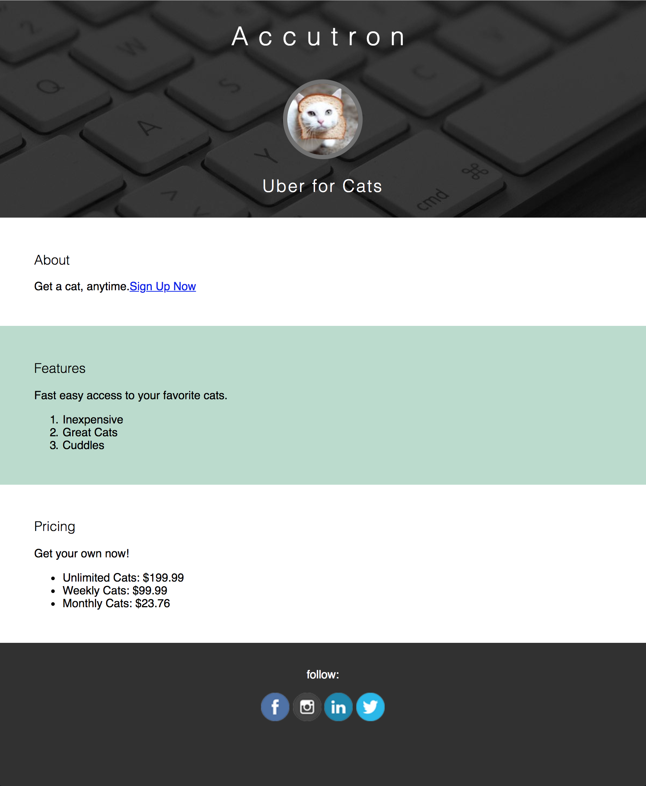

# Intro to Coding

Instructions:

1. Extract the folder that downloads:
2. On a Mac: double click on the zip file and it will extract
  ( On Windows: open the zip folder and hit ‘Extract all’ in the menu bar )
3. Open Sublime Text 3
4. Drag the entire folder you unzipped onto the Sublime Text window

If you don't hacve sublime text, how to use OSX text edit to make code:
https://gph.is/2r05jTJ

Link to slides: https://goo.gl/zBiUwY

Link to live code site: http://www.floobits.com/awongh/intro

